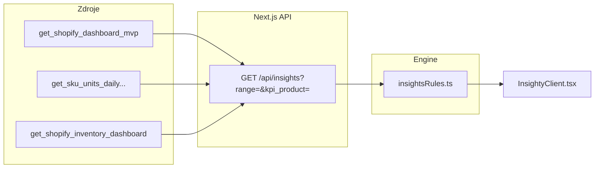

# Návrh: Insighty (riziká a príležitosti) — MO–JA dashboard

Dokument popisuje, ako pridať vrstvu **interpretácie** nad existujúce dáta predaja a skladu. Cieľ: po otvorení dashboardu hneď vidieť *čo si vyžaduje pozornosť* a *kde je priestor na rast* — bez ručného čítania všetkých grafov.

---

## 1. Ciele a princípy

| Princíp | Popis |
|--------|--------|
| **Deterministické** | Pravidlá s jasnými prahmi; rovnaké dáta = rovnaké insighty (auditovateľné). |
| **Krátke** | 1 titulok + 1–2 vety + voliteľné číslo; žiadne eseje. |
| **Kontext obdobia** | Insighty rešpektujú filter 30d / 90d / 365d a produkt (všetky / Phase bez / Phase+). |
| **Oddelené riziko / príležitosť** | Vizuálne dva stĺpce alebo sekcie (⚠ / ✦). |
| **Bez LLM v MVP** | Generovanie v TypeScript alebo SQL; LLM len vo fáze 3 (voliteľné). |

---

## 2. Umiestnenie v UI

**Odporúčanie:** nová položka v navigácii + samostatná stránka.

```
Predaj | Sklad | Insighty
```

- **URL:** `/insighty` (predvolene rovnaké obdobie ako Predaj — `365d`).
- **Layout:** pod toolbarom dve kolóny na desktope (Riziká | Príležitosti), na mobile pod sebou.
- **Alternatíva (fáza 1b):** blok „Insighty“ nad KPI na `/` — rýchlejšie, menej navigácie.

Každá karta insightu:

```
[⚠ Riziko]  Tržby klesli oproti predchádzajúcemu obdobiu
            Posledných 30 dní −12,4 % vs. predchádzajúcich 30 dní (11 200 € → 9 810 €).
            [Zobraziť tržby po dňoch →]  (anchor / link na Predaj s range=30d)
```

---

## 3. Architektúra dát



### Volanie API

`GET /api/insights?range=365d&kpi_product=all`

1. Paralelne načíta **aktuálne** a **predchádzajúce** obdobie (rovnaká dĺžka okna):
   - `get_shopify_dashboard_mvp(range)` → KPI, daily, monthly, purchase distribution, interval histogram, top products
   - `get_shopify_dashboard_mvp(prev_range)` — nový parameter alebo druhý call s vypočítaným `from/to` pred oknom
   - voliteľne `get_shopify_inventory_dashboard()` pre skladové insighty (bez produktového filtra, alebo mapovanie SKU)
2. `evaluateInsights(current, previous, inventory)` → pole `Insight[]`
3. Zoradenie: `severity` (critical → info), potom `priority`

### Typ `Insight`

```ts
type InsightKind = "risk" | "opportunity";
type InsightSeverity = "critical" | "warning" | "info";

type Insight = {
  id: string;           // napr. "revenue_decline_30d"
  kind: InsightKind;
  severity: InsightSeverity;
  title: string;        // SK, max ~80 znakov
  body: string;         // SK, 1–2 vety s číslami
  metric?: { label: string; value: string; delta?: string };
  link?: { href: string; label: string };  // /?range=30d#charts
};
```

---

## 4. Porovnanie období (technická poznámka)

Väčšina pravidiel potrebuje **delta** oproti predchádzajúcemu obdobiu rovnakej dĺžky:

| `range` | Aktuálne okno | Predchádzajúce okno |
|---------|----------------|---------------------|
| `30d` | posledných 30 dní | 30 dní pred tým |
| `90d` | posledných 90 dní | 90 dní pred tým |
| `365d` | od spustenia (Nov 2025) | *špeciálne* — porovnať posledných 90d vs. predchádzajúcich 90d v rámci YTD, alebo Q1 vs Q2; v MVP stačí **posledný mesiac vs. predchádzajúci mesiac** z `monthlyNewVsReturning` |

**Implementácia:** buď rozšíriť RPC o `p_compare: 'previous_period'`, alebo v API route dva RPC call s explicitnými dátumami (už máte `meta.from` / `meta.to` v odpovedi).

---

## 5. Katalóg pravidiel — Predaj

Prahové hodnoty sú **východiskové** — doladiť po 2–4 týždňoch používania (`insights.config.ts`).

### Riziká ⚠

| ID | Podmienka | Severity | Text (šablóna) |
|----|-----------|----------|----------------|
| `revenue_decline` | Tržby v okne −≥10 % vs. predch. obdobie | warning / critical (−20 %) | „Tržby v {obdobie} klesli o {pct} % ({prev} → {curr}).“ |
| `orders_decline` | Objednávky −≥10 % | warning | „Počet objednávok klesol o {pct} %.“ |
| `aov_decline` | AOV −≥8 % pri stabilných objednávkach | info | „Priemerná hodnota objednávky klesla; skontroluj zľavy / mix.“ |
| `returning_share_drop` | `returning_customers_pct` −≥5 p. b. | warning | „Podiel opakovaných zákazníkov klesol na {pct} %.“ |
| `new_revenue_share_high` | Podiel tržieb „noví“ v poslednom mesiaci ≥70 % pri klesajúcom returning | warning | „Rast závisí hlavne od nových zákazníkov; retencia slabne.“ |
| `one_time_buyers_high` | Bucket „1 nákup“ ≥55 % zákazníkov | warning | „{pct} % zákazníkov má len jeden nákup v období.“ |
| `long_second_purchase` | `avg_days_first_to_second` ≥90 dní | info | „Priemer medzi 1. a 2. nákupom je {days} dní — onboarding / email.“ |
| `revenue_trend_down` | Lineárny trend `dailyRevenue` za posledných 14d < 0 (sklon) | info | „Posledné 2 týždne tržby klesajú (trend).“ |
| `sku_units_decline` | Top SKU podľa tržieb: denné kusy −≥25 % (posledných 14d vs. predch. 14d) | warning | „{sku}: predaj kusov spomalil.“ |
| `concentration_top_customer` | Top 1 zákazník >15 % obratu v okne | info | „Obrat je koncentrovaný u jedného zákazníka (ID {id}).“ |

### Príležitosti ✦

| ID | Podmienka | Severity | Text (šablóna) |
|----|-----------|----------|----------------|
| `revenue_growth` | Tržby +≥10 % vs. predch. | info | „Tržby rástli o {pct} % — pokračuj v tom, čo funguje.“ |
| `orders_growth` | Objednávky +≥10 % | info | „Nárast objednávok o {pct} %.“ |
| `aov_growth` | AOV +≥8 % | info | „Vyšší košík (+{pct} % AOV).“ |
| `returning_share_up` | `returning_customers_pct` +≥5 p. b. | info | „Retencia sa zlepšila ({pct} % opakovaných).“ |
| `returning_revenue_dominant` | Vracajúci sa ≥60 % mesačných tržieb (posledný plný mesiac) | info | „Väčšinu obratu tvoria vracajúci sa zákazníci.“ |
| `short_second_purchase` | Priemer 1.→2. nákup ≤30 dní | info | „Zákazníci sa rýchlo vracajú (priemer {days} dní).“ |
| `multi_purchase_growth` | Podiel zákazníkov s 3+ nákupmi rastie (porovnanie bucketov) | info | „Viac zákazníkov s 3+ nákupmi.“ |
| `sku_units_growth` | Top SKU: kusy +≥25 % (14d vs 14d) | info | „{sku}: silný rast predaja.“ |
| `product_mix_opportunity` | Jeden produkt <20 % tržieb ale +rýchly rast kusov | info | „{label} rastie — zváž sklad / kampane.“ |
| `high_ltv_low_orders` | Zákazníci s vysokým LTV v okne ale 1 objednávka (z top + distribúcie) | info | „Hodnotní jednorazoví zákazníci — priestor na druhý nákup.“ |

**Kritické** (`critical`): kombinácia napr. `revenue_decline` ≥20 % **a** `returning_share_drop` — jedna agregovaná karta „Dvojitý tlak: pokles tržieb a retencie“.

---

## 6. Katalóg pravidiel — Sklad (voliteľné vo fáze 2)

| ID | Podmienka | Kind |
|----|-----------|------|
| `stockout_soon` | `estimated_stockout_date` ≤ dnes + 14 dní a `avg_daily_units_sold_ytd` > 0 | risk |
| `stockout_critical` | stockout ≤ 7 dní | critical |
| `zero_available_with_demand` | `available` = 0 a YTD denný predaj > 0,1 | critical |
| `slow_mover` | `available` vysoké, `avg_daily_units_sold_ytd` ≈ 0 | info / opportunity (odpisy?) |
| `stock_vs_sales_mismatch` | SKU v top 5 predaja a stockout <30 dní | risk |

Prepojenie Predaj ↔ Sklad: match podľa `product_title` / SKU z `topProducts` a inventárnych riadkov.

---

## 7. Konfigurácia prahov

Súbor `web/lib/insights/config.ts` (budúci):

```ts
export const INSIGHT_THRESHOLDS = {
  revenueDeclinePct: 10,
  revenueDeclineCriticalPct: 20,
  oneTimeBuyerPct: 55,
  returningShareDropPp: 5,
  stockoutWarningDays: 14,
  stockoutCriticalDays: 7,
  trendDays: 14,
} as const;
```

Prahov môže byť menej pri `365d` (iná šumová hladina) — v configu per `range`.

---

## 8. Fázy implementácie

### Fáza 1 — MVP (odhad 2–3 dni)

- [ ] `web/lib/insights/` — typy, config, `evaluateInsights.ts` (~15 pravidiel len predaj)
- [ ] `GET /api/insights` — dva dashboard RPC call (current; previous period dates vypočítané v TS)
- [ ] `web/app/insighty/page.tsx` + `InsightyClient.tsx`
- [ ] `HeaderSectionSelect` — tretia voľba „Insighty“
- [ ] Žiadna nová migrácia SQL

### Fáza 2 — Sklad + odkazy (1–2 dni)

- [ ] Inventár v `/api/insights`
- [ ] Pravidlá stockout + link na `/sklad`
- [ ] Export insightov do MD (rozšírenie existujúceho exportu)

### Fáza 3 — Doladenie (podľa feedbacku)

- [ ] Prahov v env alebo Supabase tabuľka `insight_thresholds`
- [ ] História insightov (`insight_snapshots` — čo sme ukázali včera)
- [ ] Voliteľný LLM súhrn (1 odsek týždenne) — len agregáty, nie PII

---

## 9. Príklad odpovede API

```json
{
  "meta": { "range": "365d", "from": "2025-11-01", "to": "2026-05-24", "kpi_product": "all" },
  "generatedAt": "2026-05-25T07:00:00+02:00",
  "risks": [
    {
      "id": "one_time_buyers_high",
      "kind": "risk",
      "severity": "warning",
      "title": "Veľa jednorazových zákazníkov",
      "body": "58,2 % zákazníkov v období má len 1 nákup. Zameraj sa na druhý nákup (email, balíček).",
      "metric": { "label": "1× nákup", "value": "58,2 %" },
      "link": { "href": "/?range=365d", "label": "Otvoriť predaj" }
    }
  ],
  "opportunities": [
    {
      "id": "returning_revenue_dominant",
      "kind": "opportunity",
      "severity": "info",
      "title": "Silná základňa vracajúcich sa",
      "body": "V apríli 2026 tvorili vracajúci sa zákazníci 68 % mesačných tržieb.",
      "link": { "href": "/?range=365d", "label": "Mesačný graf" }
    }
  ]
}
```

---

## 10. Čo zámerne nie je v MVP

- Predikcie (ML) — len pravidlá a trendy
- Odporúčania cien / marketing budget
- Email notifikácie (cron) — až fáza 3
- Porovnanie s externým trhom

---

## 11. Otvorené otázky (na rozhodnutie)

1. **Predvolené obdobie na /insighty** — `365d` ako Predaj, alebo vždy `90d` (citlivejšie na trendy)?
2. **Koľko kariet max** — napr. top 5 rizík + top 5 príležitostí, zvyšok „Zobraziť všetky“?
3. **Sklad hneď vo fáze 1** alebo až po feedbacku na predajné insighty?
4. **Prahové hodnoty** — máš interné ciele (napr. returning ≥25 %)? Ak áno, doplníme do configu.

---

## 12. Súvisiace súbory v repozitári

| Súčasť | Súbor |
|--------|--------|
| Predaj payload | `web/app/DashboardClient.tsx` (`Payload`) |
| Dashboard API | `web/app/api/dashboard/route.ts` |
| RPC | `supabase/migrations/045_dashboard_kpi_product_filter.sql` (+ 048–050) |
| Sklad | `web/app/sklad/SkladClient.tsx`, `get_shopify_inventory_dashboard` |
| Navigácia | `web/app/components/HeaderNav.tsx` |

---

*Návrh v1 — máj 2026. Ďalší krok: schválenie prahov + fáza 1 v Agent mode.*
